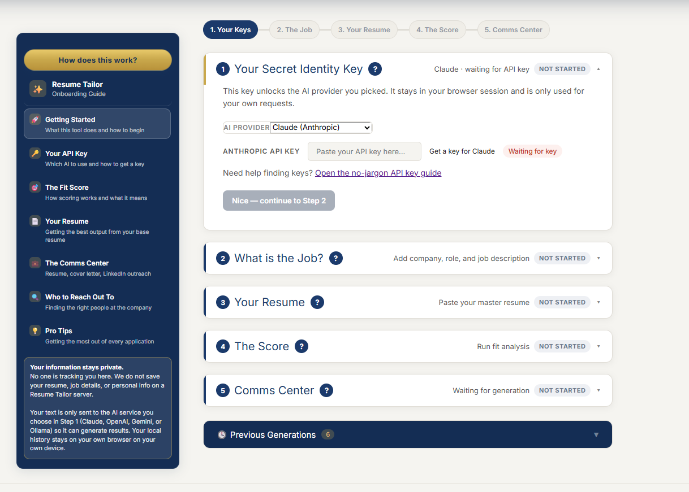
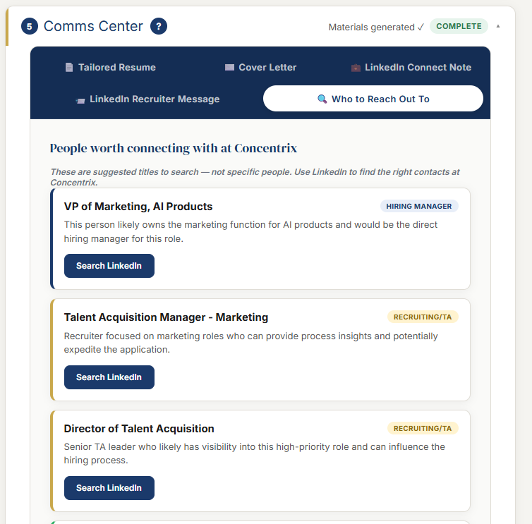

# Resume Tailor (Open Source)

Resume Tailor helps job seekers go from **job post → tailored application package** in one focused workflow.

It is built to reduce repetitive rewriting, improve message alignment, and give you cleaner first drafts fast.

---

## What's New

- Step 4 now includes a recommendation layer after scoring: apply as-is vs customize first, with clear thresholds.
- Step 5 generation is now selectable so users can generate only what they need (resume rewrite, cover letter, LinkedIn pack) and reduce token usage.
- Step 2 URL import is now labeled as **Try auto-fill** and treated as best effort, with clearer guidance when job sites block extraction.

---

## Who This Is For

- Job seekers who want stronger, role-specific applications without starting from scratch every time
- Career switchers translating existing experience into a new function or industry
- Professionals applying to multiple roles and needing a faster, repeatable workflow
- People who want practical AI assistance but still keep final editorial control

---

## What You Get

From one target role and your base resume, Resume Tailor generates:

- Tailored resume
- Tailored cover letter
- LinkedIn connection note
- LinkedIn recruiter/hiring manager message
- Suggested outreach titles (who to find and contact)

You can copy everything immediately and download key documents when needed.
You can also choose to generate only what you need (resume rewrite, cover letter, and/or LinkedIn pack) to reduce token usage.

---

## Why People Use It

Most job applications fail on speed or consistency:
- Resume not aligned to the role language
- Cover letter too generic
- Outreach started too late (or not at all)

Resume Tailor gives you a practical system:
1. Qualify the role with a fit score
2. Tailor your materials in one pass
3. Leave with both assets and outreach angles

---

## Quick Start

1. Download or clone this repository.
2. Open `index.html` in your browser.
3. Choose an AI provider and add your key (or use Ollama locally).
4. Run Steps 1–5 in sequence.

Tip: for best browser compatibility, use a local server instead of opening with `file://`.

---

## The 5-Step Workflow

### Step 1 — Your Secret Identity Key
- Select provider: Claude, ChatGPT, Gemini, or Ollama
- Add your API key (or local Ollama host/model)
- Confirm provider readiness before moving on

### Step 2 — What Is the Job?
- Add company, role title, and full job description
- Optional: use **Try auto-fill from URL** (best effort; some job sites block extraction)
- Confirm details are accurate before scoring

### Step 3 — Your Resume
- Paste your master resume (recommended)
- You can upload PDF/Word/TXT, but direct paste is usually cleaner
- Best practical workflow: open resume in PDF/Word, Select All, Copy, Paste

### Step 4 — The Score
- Run fit analysis before generating final materials
- Get:
  - 0–100 fit score
  - top strengths
  - likely gaps
- Get a recommendation on whether resume customization is likely to improve ATS alignment
- Use this as your go/no-go filter

### Step 5 — Comms Center
- Choose what to generate first (resume rewrite, cover letter, LinkedIn pack) to save API tokens
- Review all output tabs in one place
- Copy, edit, and export as needed
- Use the outreach tab to quickly identify titles worth contacting on LinkedIn

---

## Screenshots

### Main Workflow


### Fit Analysis


### Generated Outputs


---

## Privacy & Data Handling

Resume Tailor does **not** run a project-owned backend that stores your resume or job content.

When you click analyze/generate, your prompt is sent directly from your browser to the provider you selected:

- Anthropic (Claude)
- OpenAI (ChatGPT)
- Google (Gemini)
- Local Ollama (if configured)

History is saved in your browser storage on your own device.

---

## Provider Guidance

| Provider | Best for | Notes |
|---|---|---|
| Claude | High-quality tone and nuanced rewrite quality | Great default for polished first drafts |
| ChatGPT (`gpt-4o`) | Balanced speed + consistency | Reliable for structured outputs |
| Gemini (`gemini-1.5-flash`) | Fast iteration and lower-cost loops | Strong for frequent revision |
| Ollama (local) | Local-first privacy workflows | Requires setup + compatible local model |

If you are unsure, start with Claude or ChatGPT, then optimize for speed/cost.

---

## Fit Recommendation Rubric

Resume Tailor now adds a second recommendation after Step 4 so users know whether resume rewriting is likely to materially change ATS response odds.

### Decision Thresholds

| Score band | Critical gap count* | Recommendation | Expected rewrite impact |
|---|---:|---|---|
| 82–100 | 0 | Apply now, customization optional | Low |
| 68–81 | 0–1 | Apply, do a targeted resume pass | Moderate |
| 50–67 | any | Customize before applying | High |
| 0–49 | any | Not a strong fit right now | Very high gap risk |

\* Critical gap count is estimated from gap bullets that include terms like `must`, `required`, `missing`, `lack`, `no experience`, or `not demonstrated`.

### Pseudocode

```text
critical_gaps = count(gap_bullets matching critical_gap_keywords)

if score >= 82 and critical_gaps == 0:
  recommendation = "Apply now. Resume customization is optional."
  impact = "Low"
elif score >= 68 and critical_gaps <= 1:
  recommendation = "Apply, but do a targeted resume pass first."
  impact = "Moderate"
elif score >= 50:
  recommendation = "Customize before applying."
  impact = "High"
else:
  recommendation = "Not a strong fit right now."
  impact = "Very high gap risk"
```

Use this as directional guidance, not a guarantee.

---

## Troubleshooting

### API call errors / retries
- Verify key format and account credits
- Retry after a short delay (temporary provider overload is common)
- Switch providers if needed

### URL fetch does not work
Some sites block extraction/proxy flows, so URL auto-fill is best effort.  
Fallback: copy/paste the job description directly in Step 2.

### Uploaded PDF text looks messy
PDF extraction can reorder content depending on the source file.  
Best workaround: copy/paste plain text from your resume into Step 3.

---

## Documentation

- Setup guide: `docs/SETUP.md`
- API key guide: `docs/API_KEYS.md`

---

## Contributing

Contributions are welcome, especially for:
- prompt quality
- UI/UX polish
- provider/model reliability
- onboarding and documentation clarity

Open an issue or PR with expected behavior, actual behavior, and screenshots when helpful.

---

## Attribution

Built by [Michael Findling](https://linkedin.com/in/michaelfindling)  
Website: [gtmstack.pro](https://gtmstack.pro)
